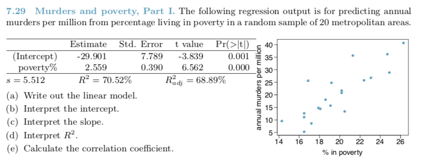

DATA 606 
Ch. 7 Problem 29
========================================================
author: Alexander L Niculescu
date: 24 NOV 18
autosize: true

========================================================

========================================================
\[
  \hat{height} = beta_0 - beta_1*\hat{shoulder girth}
\]

Slide With Plot
========================================================

